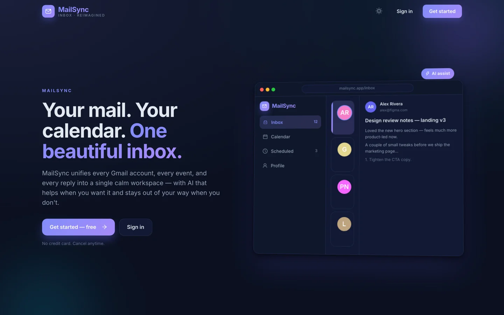
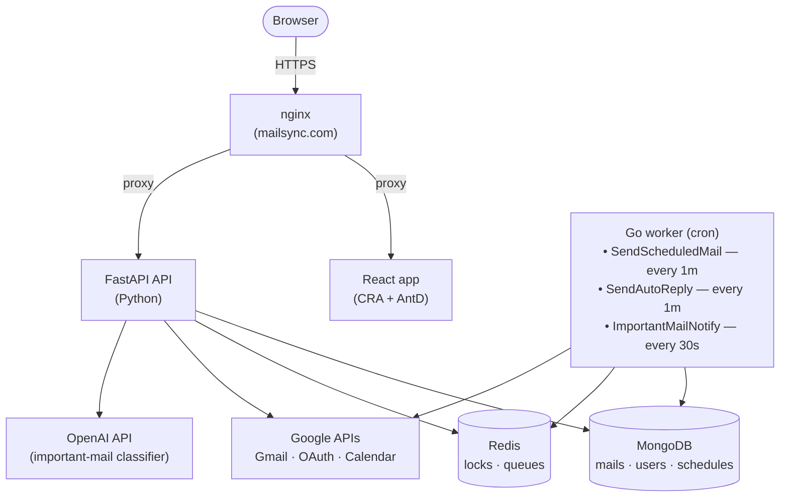

<div align="center">

# Mail Sync

**One inbox, every account. Schedule mail, set vacation auto-replies, surface what matters — all in one place.**

[](backend/)
[](frontend/)
[](worker/)
[](docker-compose.dev.yml)
[](#)

<br/>



</div>

---

## What it does

Mail Sync stitches several Google accounts into a single, opinionated workspace.

- **Unified inbox** — link multiple Gmail accounts, browse and search them together.
- **Smart scheduling** — write a mail now, send it later. Cron worker handles delivery.
- **Auto‑replies on a calendar** — set vacation/out‑of‑office windows visually; the worker auto‑replies during those windows.
- **Important‑mail detection** — OpenAI classifies incoming mail; the important ones get a notification.
- **Unified calendar** — all linked Google Calendars merged into one FullCalendar view, color‑coded per account.
- **End‑to‑end HTTPS in dev** — local mkcert + nginx so OAuth callbacks behave like production.

---

## Architecture



> nginx is the only thing the browser talks to. It terminates TLS and proxies to React (HMR included) and FastAPI. Outbound calls to Google / OpenAI happen from the backend and the worker, never from nginx.

| Layer | Stack |
|---|---|
| Frontend | React 18, TypeScript, Ant Design 5, FullCalendar, Draft.js, SWR, React Router |
| Backend  | FastAPI, Motor (async MongoDB), Google API client, OpenAI, JWT, structlog |
| Worker   | Go 1.22, robfig/cron, mongo‑driver, go‑redis |
| Infra    | Docker Compose, nginx + mkcert (TLS), MongoDB, Redis |

---

## Quick start

### Prerequisites
- Docker & Docker Compose
- [mkcert](https://github.com/FiloSottile/mkcert) (`brew install mkcert nss`) — for local HTTPS
- A Google Cloud project with OAuth credentials (Gmail + Calendar scopes)
- An OpenAI API key

### 1. Clone & configure

```bash
git clone <this-repo> mail-sync
cd mail-sync
cp backend/.env.example backend/.env
```

Edit [backend/.env](backend/.env.example) and set, at minimum:

```ini
RUNTIME_ENVIRONMENT=local
LOG_LEVEL=INFO

GOOGLE_CLIENT_ID=...
GOOGLE_CLIENT_SECRET=...
GOOGLE_REDIRECT_URI=https://mailsync.com/oauth/google/callback

OPENAI_API_KEY=sk-...
```

> The redirect URI **must** match an authorized URI in your Google Cloud Console.

### 2. Start everything

```bash
make start
```

This will:

1. Generate a local TLS cert for `mailsync.com` via mkcert.
2. Add `mailsync.com` to `/etc/hosts` (sudo prompt the first time).
3. Bring up the full stack via Docker Compose.

When it finishes you'll see:

```
✓ https://mailsync.com
```

Open it. You should land on the sign‑in page.

---

## Make targets

| Command | What it does |
|---|---|
| `make start`       | Generate certs (if missing) and start the stack |
| `make stop`        | Stop all containers |
| `make restart`     | `stop` then `start` |
| `make rebuild`     | Rebuild images and restart |
| `make logs`        | Tail logs from all services |
| `make clean`       | `down -v` — wipes containers **and volumes** (Mongo data, Redis data) |
| `make certs`       | Ensure mkcert CA + cert + `/etc/hosts` entry exist |
| `make regen-certs` | Force‑regenerate the local TLS cert |

---

## Project layout

```
mail-sync/
├── backend/                # FastAPI service
│   ├── main.py             # app factory, router registration
│   └── src/
│       ├── authentication/ # JWT + Google OAuth login
│       ├── user/           # user accounts
│       ├── link_mail_address/  # add/remove linked Gmail accounts
│       ├── mails/          # list, search, send mail
│       ├── calendars/      # unified calendar API
│       ├── schedule_mail/        # scheduled-send queue
│       ├── schedule_auto_reply/  # vacation/auto-reply windows
│       ├── important_mail/       # OpenAI classifier
│       ├── notifications/        # in-app notifications
│       ├── google/         # Google API client wrappers
│       ├── openai/         # OpenAI client
│       ├── common/         # shared utils, mongo helpers
│       └── logger/         # structlog + ASGI access log
│
├── frontend/               # React + TypeScript app (CRA)
│   └── src/
│       ├── pages/          # landing, sign-in/up, home, mails, calendar, schedule, profile, oauth
│       ├── components/     # GlassCard, layout, rich-text editor, calendar wrappers…
│       ├── api/            # axios + SWR hooks
│       ├── hooks/          # shared React hooks
│       └── themes/         # Ant Design theme
│
├── worker/                 # Go cron worker
│   ├── cmd/cronjob/main.go
│   └── internal/
│       ├── cron/                       # scheduler
│       ├── scheduled_mails/            # send queued mails
│       ├── scheduled_auto_replies/     # send auto-replies in window
│       ├── important_mail_notification/# enqueue notifications
│       ├── mailsync/                   # Gmail integration
│       ├── linked_mail_address/        # account access
│       ├── db/mongodb, redis, lock     # infra
│       └── pool/                       # worker pool
│
├── nginx/                  # reverse proxy + TLS
├── docker-compose.dev.yml  # api, app, worker, mongo, redis
├── docker-compose.https.yml# nginx + TLS overlay
└── Makefile
```

---

## How the worker decides what to do

The Go worker runs three crons against MongoDB and Redis:

| Job | Period | What it does |
|---|---|---|
| `SendScheduledMail`         | every 1m  | Pulls due `schedule_mail` documents and sends them through Gmail. |
| `ScheduledAutoReplyService` | every 1m  | For each active auto‑reply window, replies to incoming mail once per sender. |
| `AddImportantMailNotification` | every 30s | Picks up newly‑classified important mail and writes a notification. |

Locks live in Redis so multiple worker replicas don't double‑send.

---

## Development tips

- **Backend hot‑reload** — `backend/src` is bind‑mounted; uvicorn reloads on change. A debugpy listener is exposed on `:7901`.
- **Frontend hot‑reload** — `frontend/src` is bind‑mounted; CRA's HMR is wired through nginx (`WDS_SOCKET_PORT=0`).
- **Mongo** — exposed on `localhost:27017` (`admin / password`). Connect from a GUI for inspection.
- **Redis** — exposed on `localhost:6379`.
- **API docs** — FastAPI's auto‑generated docs live at `https://mailsync.com/api/docs` (or whatever your nginx route is).

---

## Troubleshooting

| Symptom | Fix |
|---|---|
| Browser warns about cert | Re‑run `mkcert -install`, then `make regen-certs`. |
| OAuth redirect mismatch | Make sure `GOOGLE_REDIRECT_URI` in `backend/.env` is added under *Authorized redirect URIs* in Google Cloud Console. |
| `mailsync.com` won't resolve | Check `/etc/hosts` contains `127.0.0.1 mailsync.com`. `make certs` adds it. |
| Important‑mail notifications never appear | Verify `OPENAI_API_KEY` is set and the worker container is running (`make logs`). |
| Want a clean slate | `make clean` wipes Mongo + Redis volumes. |

---

## License

Private / unreleased.
